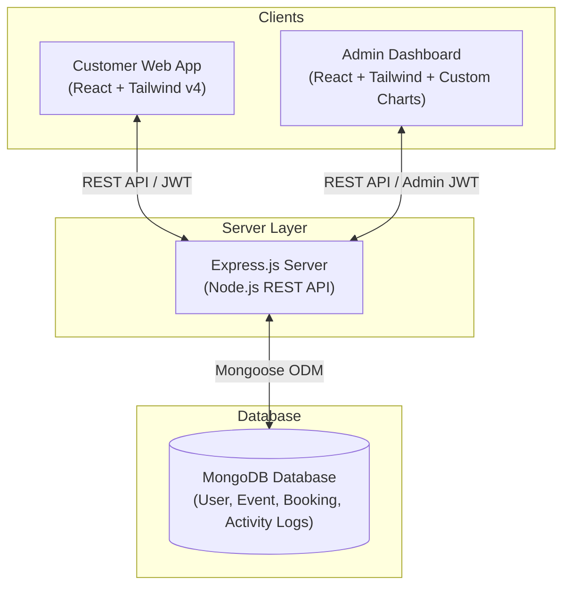

# 📅 Eventify: Premium Event Planning & Management Platform

A modern, comprehensive, full-stack event planning and management platform. This project is structured as a monorepo containing a customer-facing client, a dedicated administrative dashboard, and a robust Node.js/Express backend API backed by MongoDB.

---

## 🗺️ System Architecture

The platform is designed with a decoupled architecture where the clients (User and Admin) communicate via REST APIs with the Express backend, which interacts with MongoDB.



---

## 📂 Repository Structure

Below is the layout of the monorepo:

```text
├── 2026 event/                       # Customer Frontend Client (Vite + React)
│   ├── src/
│   │   ├── components/               # UI components (Budget, Weather, Progress Ring, etc.)
│   │   ├── pages/                    # Event Type & Functional Pages
│   │   └── context/                  # React State & Context Providers
│   └── package.json
│
├── Admin Dashboard/                  # Administrative Workspace (Vite + React)
│   ├── src/
│   │   ├── components/               # Custom interactive SVG charts & components
│   │   ├── utils/                    # API wrappers
│   │   └── App.jsx                   # Central Hub & Admin logic
│   └── package.json
│
├── Event Planning Backend/
│   └── Event Planning Backend/       # Node.js + Express + Mongoose Backend
│       ├── src/
│       │   ├── config/               # Database connection settings
│       │   ├── controllers/          # Business logic handlers
│       │   ├── middleware/           # Authentication & role verification
│       │   ├── models/               # Mongoose schemas (User, Event, Booking, ActivityLog)
│       │   ├── routes/               # Express endpoints mapped to controllers
│       │   └── seed/                 # Database seed script for initial testing
│       ├── db.json                   # Mock / Backup reference database
│       ├── server.js                 # Entry point of the Express server
│       └── package.json
│
├── package.json                      # Monorepo Orchestration (Wrapper scripts)
└── README.md                         # Project documentation
```

---

## 🛠️ Technology Stack

### Core Technologies
*   **Database:** MongoDB with Mongoose ODM (Object Document Mapper)
*   **Backend:** Node.js, Express.js
*   **Frontend Clients:** React (v19), Vite (v7/v8)
*   **Styling & Design:** Tailwind CSS (v4), Lucide Icons, Glassmorphism design principles

### Key Dependencies
*   **Authentication:** JSON Web Tokens (JWT), BcryptJS (Password hashing)
*   **System Log:** Morgan HTTP request logger
*   **Cross-Origin:** CORS middleware
*   **Environment Management:** Dotenv

---

## ✨ Features

### 👤 Customer Frontend (`2026 event/`)
*   **Theme & Design:** Built with premium rose pink & soft grey glassmorphic layouts, animations, and transitions.
*   **Interactive Booking Wizard:** A step-by-step interactive booking form (Date ➔ Venue ➔ Guests).
*   **Advanced Planning Tools:**
    *   **Budget Tracker:** Interactive widget to compute event expenditures dynamically.
    *   **Weather Widget:** Interactive widget to check event date weather forecasts.
    *   **Location Selector:** Responsive mapping location selector.
    *   **Planning Progress Ring:** Circular animated trackers displaying completion stages.
    *   **Event Countdown:** Dynamic countdown timers for upcoming booked events.
*   **Event Exploration:** Search, filter, and categorised pages for Weddings, Anniversaries, Corporate Meetings, Baby Showers, and Birthday Parties.
*   **User Profiles:** Dedicated workspace where users manage booking histories, view active counts, and update records.

### 📊 Admin Dashboard (`Admin Dashboard/`)
*   **Aesthetics:** Sleek, high-performance dark-theme UI built with Slate & Emerald tones.
*   **Analytics:** Interactive SVG-based Area Charts representing booking trends, user growth, and active system operations.
*   **Control Room:**
    *   **User Management:** List all registered users with fast filters.
    *   **Booking Supervision:** Monitor client bookings and update statuses (e.g. Approved, Pending, Completed).
    *   **Audit Logging:** Live tracking of system activity logs to capture administrative actions and login histories.

### 🌐 Backend API REST Server (`Event Planning Backend/`)
*   Fully structured model system featuring `User`, `Event`, `Booking`, and `ActivityLog` definitions.
*   Secure routes protected by JWT authorization token extraction.
*   Database seeding utilities for immediate test deployment.

---

## ⚙️ Prerequisites

Before running the application, make sure you have:
*   [Node.js](https://nodejs.org/) installed (v18+ recommended)
*   [MongoDB](https://www.mongodb.com/) running locally or a MongoDB Atlas connection URI

---

## 🚀 Getting Started & Local Setup

### Step 1: Clone the Repository
Clone your project repository and navigate to the project root:
```bash
git clone https://github.com/Kishor-76/Event-Planning-.git
cd Event-Planning-
```

### Step 2: Install All Dependencies
We have a custom command to install dependencies recursively across all packages (Root, Frontend, Admin Dashboard, and Backend):
```bash
npm run install-all
```

### Step 3: Configure Environment Variables
Navigate to the backend server directory and set up your `.env` file:
```bash
cd "Event Planning Backend/Event Planning Backend"
cp .env.example .env
```
Open `.env` and fill in the following configurations:
```env
PORT=5000
MONGO_URI=mongodb://localhost:27017/eventify
JWT_SECRET=your_super_secret_jwt_key
```

### Step 4: Seed the Database (Optional)
To populate MongoDB with initial sample events and data:
```bash
npm run seed
```
*(This triggers the `seedEvents.js` script to set up starting resources).*

### Step 5: Start the Development Server
Return to the project root directory and run:
```bash
npm run dev
```
This commands uses `concurrently` to spin up three development environments at once:
*   **Customer Frontend:** [http://localhost:5173](http://localhost:5173)
*   **Admin Dashboard:** [http://localhost:5174](http://localhost:5174)
*   **Backend Server:** [http://localhost:5000](http://localhost:5000)

---

## 🔌 API Documentation (Backend endpoints)

All backend requests start with `http://localhost:5000/api`.

### 🔑 Authentication (`/api/auth`)
| Method | Endpoint | Description | Headers / Auth |
| :--- | :--- | :--- | :--- |
| **POST** | `/register` | Create a new user account | *None* |
| **POST** | `/login` | Authenticates user and returns JWT | *None* |
| **GET** | `/me` | Fetch details of currently authenticated user | `Authorization: Bearer <token>` |

### 📅 Events Operations (`/api/events`)
| Method | Endpoint | Description | Auth Required |
| :--- | :--- | :--- | :--- |
| **GET** | `/` | Retrieve all events (supports `category` and `search` query parameters) | No |
| **GET** | `/:id` | Retrieve detailed event details | No |
| **POST** | `/` | Create a new event profile | Yes (Admin) |
| **PUT** | `/:id` | Update existing event metrics | Yes (Admin) |
| **DELETE**| `/:id` | Delete event profile | Yes (Admin) |

### 📝 Bookings Operations (`/api/bookings`)
| Method | Endpoint | Description | Auth Required |
| :--- | :--- | :--- | :--- |
| **POST** | `/` | Book a specific event | Yes (User) |
| **GET** | `/` | List all bookings | Yes (User / Admin) |
| **GET** | `/:id` | Retrieve details of a booking | Yes (User / Admin) |
| **PUT** | `/:id/status` | Update status (Pending, Approved, Cancelled) | Yes (Admin) |

### 📊 Admin Operations (`/api/admin`)
| Method | Endpoint | Description | Auth Required |
| :--- | :--- | :--- | :--- |
| **GET** | `/stats` | Aggregate dashboard statistics | Yes (Admin) |
| **GET** | `/logs` | Fetch system audit/activity logs | Yes (Admin) |

---

## 💻 Monorepo Scripts Reference

Execute these from the project root directory:

*   `npm run install-all`: Download and configure node modules recursively in all folders.
*   `npm run dev`: Launch clients and servers concurrently.
*   `npm run dev:frontend`: Launch Vite development server exclusively for the user application.
*   `npm run dev:backend`: Launch Nodemon development backend watcher.
*   `npm run dev:admin`: Launch Vite development server exclusively for the Admin Dashboard.
*   `npm run build`: Bundles the production frontend application.
*   `npm run seed`: Initiates backend setup seeding sequence.
